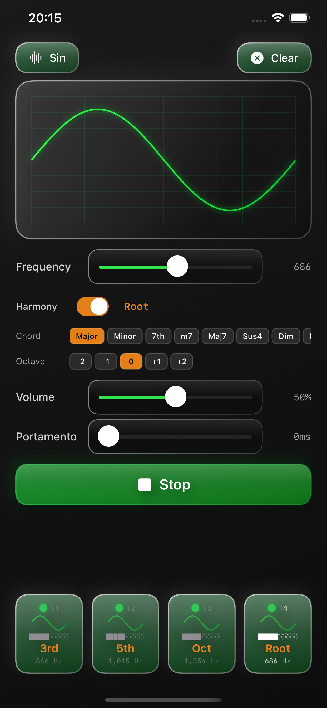

# OscDrax

リアルタイムオーディオ合成、カスタム波形描画、マルチトラック制御を備えた強力なiOS波形シンセサイザーアプリ



## 機能

### 🎵 4トラックオーディオシステム
- 4つの独立したオシレータートラック
- 個別の周波数、音量、ポルタメント制御
- AVAudioEngineを使用したリアルタイムオーディオ合成

### 🎨 インタラクティブ波形エディタ
- タッチジェスチャーでカスタム波形を描画
- 512ポイントの波形解像度
- リアルタイム波形プレビュー
- プリセット波形（サイン波、三角波、矩形波、ノコギリ波）

### 🎛️ プロフェッショナルコントロール
- **周波数制御**: 20Hz - 20kHz（対数スケール）
- **音量制御**: 0-100%（視覚的フィードバック付き）
- **ポルタメント**: 0-1000ms（周波数間のグライドタイム）
- **視覚的フィードバック**: アクティブトラックの緑色グロー表示

### 💎 リキッドグラスUIデザイン
- カスタムグラスモーフィックデザインシステム
- スムーズなアニメーションとトランジション
- 音楽制作に最適化されたダークテーマ
- レスポンシブなタッチコントロール

### 💾 データ永続化
- JSON形式でのトラックデータ保存
- アプリ再起動時の自動復元
- 波形、周波数、音量、ポルタメント設定の保存

## 技術詳細

### アーキテクチャ
- **SwiftUI**: モダンな宣言型UI
- **AVAudioEngine**: 低レイテンシーオーディオ処理
- **Combine**: リアクティブデータフロー
- **MVVM**: アーキテクチャパターン

### オーディオエンジン
- カスタムウェーブテーブル合成実装
- グリッチフリーオーディオのためのロックフリーパラメータ更新
- 正確な周波数生成のためのフェーズアキュムレータ
- スムーズな波形再生のための線形補間

### 主要コンポーネント
- `AudioEngine.swift`: コアオーディオ合成エンジン
- `OscillatorNode.swift`: カスタムオシレーター実装
- `Track.swift`: Observable プロパティを持つデータモデル
- `WaveformDisplayView.swift`: インタラクティブ波形エディタ
- `ControlPanelView.swift`: パラメータ制御インターフェース
- `PersistenceManager.swift`: トラックデータの保存/読み込み
- `AudioManager.swift`: AudioEngineとTrackモデルの統合管理

## 動作環境
- iOS 15.0以上
- Xcode 14.0以上
- Swift 5.5以上

## インストール

1. リポジトリをクローン:
```bash
git clone https://github.com/yourusername/OscDrax.git
```

2. Xcodeでプロジェクトを開く:
```bash
cd OscDrax
open OscDrax.xcodeproj
```

3. iOSデバイスまたはシミュレータでビルド＆実行

## 開発

### ビルドコマンド
```bash
make build    # プロジェクトをビルド
make clean    # ビルド成果物をクリーン
make lint     # SwiftLintを実行
make format   # SwiftLintでコードをフォーマット
make test     # ユニットテストを実行
```

### コード品質
- 85以上のopt-inルールを含む包括的なSwiftLint設定
- 厳格なコードスタイル適用
- 自動フォーマットとリント

## 使い方

1. **トラックを選択**: 下部の4つのトラックタブのいずれかをタップ
2. **波形を描画**: 指でカスタム波形を描画、またはプリセットを選択
3. **パラメータを調整**:
   - 周波数コントロールをスライドしてピッチを設定（20Hz-20kHz）
   - ミキシング用の音量を調整（0-100%）
   - スムーズな周波数遷移のためのポルタメントを設定（0-1000ms）
4. **再生**: Playボタンを押して作成した音を聴く
5. **マルチトラック**: 複数のトラックを有効にして複雑なサウンドスケープを作成
6. **設定の保存**: アプリを終了しても設定は自動的に保存され、次回起動時に復元されます

## ライセンス
Copyright © 2025 Junpei Wada. All rights reserved.